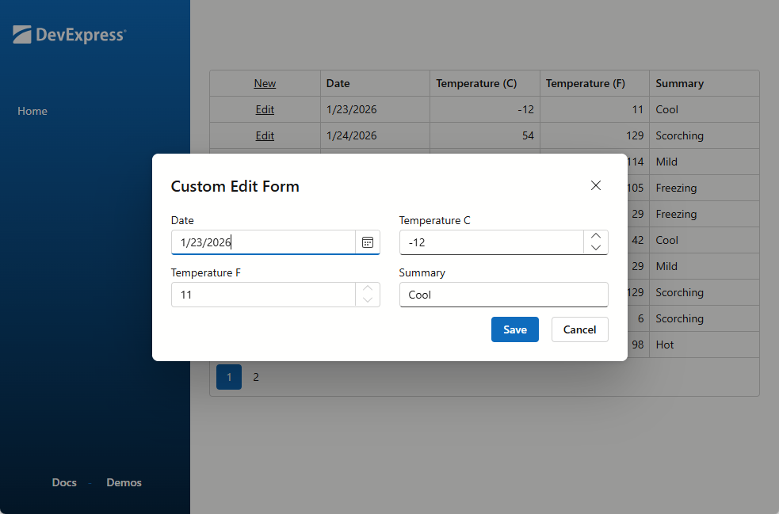

<!-- default badges list -->

[](https://supportcenter.devexpress.com/ticket/details/T1317391)
[](https://docs.devexpress.com/GeneralInformation/403183)
[](#does-this-example-address-your-development-requirementsobjectives)
<!-- default badges end -->
# Blazor Grid - Use an External Popup as an Edit Form

This example uses a [DevExpress Blazor Popup](https://docs.devexpress.com/Blazor/DevExpress.Blazor.DxPopup) as a custom edit form for the [DevExpress Blazor Grid](https://docs.devexpress.com/Blazor/DevExpress.Blazor.DxGrid) component. In this example, the edit form is resizable/draggable, and does not close on Escape.



## Implementation Details

### Data Model for the Edit Row

Implement `ShowPopup()` and `ClosePopup()` methods that create and reset an [edit model](https://docs.devexpress.com/Blazor/404759/components/grid/editing-and-validation/edit-model) (edit row data). When an edit model is available, the popup form appears (`DxPopup`). 

```
@if(PopupVisible) {
    <DxPopup Visible="PopupVisible"></DxPopup>
}

@code {
   private WeatherForecast? editModel;
   private bool PopupVisible => editModel != null;

   private void ShowPopup(object dataItem) {
      editModel = new WeatherForecast() { ... };
   }
    private void ClosePopup() {
        editModel = null;
    }
}
```

### Save User Input

Add an [EditForm](https://learn.microsoft.com/en-us/dotnet/api/microsoft.aspnetcore.components.forms.editform) to the popup. Assign a function to the [OnValidSubmit](https://learn.microsoft.com/en-us/dotnet/api/microsoft.aspnetcore.components.forms.editform.onvalidsubmit#microsoft-aspnetcore-components-forms-editform-onvalidsubmit)) property. This function updates the data source when a user posts changes that pass validation.

```
<DxPopup Visible="PopupVisible">
   <BodyContentTemplate>
      <EditForm Model="@editModel" OnValidSubmit="OnValidSubmit">
         <DataAnnotationsValidator></DataAnnotationsValidator>
      </EditForm>
   </BodyContentTemplate>
</DxPopup>

@code {
   private bool IsNew => !forecasts.Any(f => f.ID == editModel!.ID);

   private void OnValidSubmit(EditContext ctx) {
      if(ctx.Model is not WeatherForecast wf) return;
      if(IsNew)
         InsertRecord(wf);
      else
         UpdateRecord(wf);
   }
}
```

### Add Command Buttons that Display the Edit Form

Add a [command column](https://docs.devexpress.com/Blazor/DevExpress.Blazor.DxGridCommandColumn) to your Grid markup. Use [HeaderTemplate](https://docs.devexpress.com/Blazor/DevExpress.Blazor.DxGridCommandColumn.HeaderTemplate) and [CellDisplayTemplate](https://docs.devexpress.com/Blazor/DevExpress.Blazor.DxGridCommandColumn.CellDisplayTemplate) to add custom **New** and **Edit** buttons. Both buttons call the `ShowPopup()` method to initialize the edit model and display the popup form. 

```
<DxGrid>
    <Columns>
        <DxGridCommandColumn>
            <HeaderTemplate>
                <DxButton Text="New" Click="() => ShowPopup(new WeatherForecast())"></DxButton>
            </HeaderTemplate>
            <CellDisplayTemplate>
                <DxButton Text="Edit" Click="() => ShowPopup(context.DataItem)"></DxButton>
            </CellDisplayTemplate>
        </DxGridCommandColumn>
        // ...
    </Columns>
</DxGrid>
```

### Finalize the Popup Form

Populate the `DxPopup` component with required edit form content - data editors and action buttons. This example uses [DxFormLayout](https://docs.devexpress.com/Blazor/DevExpress.Blazor.DxFormLayout) to arrange UI controls.

```
<DxPopup Visible="PopupVisible">
   <BodyContentTemplate>
      <EditForm Model="@editModel" OnValidSubmit="OnValidSubmit">
         <DxFormLayout Data="@editModel">
            <DxFormLayoutItem Caption="Date" Field="Date" />
            <DxFormLayoutItem Caption="Temperature C" Field="TemperatureC" />
            <DxFormLayoutItem Caption="Temperature F" Field="TemperatureF" ReadOnly=true />
            <DxFormLayoutItem Caption="Summary" Field="Summary" />
            <DxFormLayoutItem ColSpanLg="12">
               <div class="w-100" style="display: flex; justify-content: end; gap: 1rem;">
                  <DxButton RenderStyle=ButtonRenderStyle.Primary Text="Save" SubmitFormOnClick=true></DxButton>
                  <DxButton RenderStyle=ButtonRenderStyle.Secondary Text="Cancel" Click="ClosePopup"></DxButton>
               </div>
            </DxFormLayoutItem>
         </DxFormLayout>
      </EditForm>
   </BodyContentTemplate>
</DxPopup>
```

## Files to Review

- [Index.razor](./CS/BlazorGridPopupEditFormCustomization/Components/Pages/Index.razor)

## Documentation

- [Pop-Up and Inline Edit Forms in Blazor Grid](https://docs.devexpress.com/Blazor/404757/components/grid/editing-and-validation/edit-modes/edit-forms)
- [DxPopup](https://docs.devexpress.com/Blazor/DevExpress.Blazor.DxPopup)

## More Examples

- [Grid for Blazor - How to edit a row on a separate page](https://github.com/DevExpress-Examples/blazor-grid-separate-edit-form)
- [Grid for Blazor - Create a custom record deletion confirmation dialog](https://github.com/DevExpress-Examples/blazor-grid-show-custom-confirmation-dialog)

<!-- feedback -->
## Does this example address your development requirements/objectives?

[](https://www.devexpress.com/support/examples/survey.xml?utm_source=github&utm_campaign=blazor-grid-popup-edit-form-customization&~~~was_helpful=yes) [](https://www.devexpress.com/support/examples/survey.xml?utm_source=github&utm_campaign=blazor-grid-popup-edit-form-customization&~~~was_helpful=no)

(you will be redirected to DevExpress.com to submit your response)
<!-- feedback end -->


